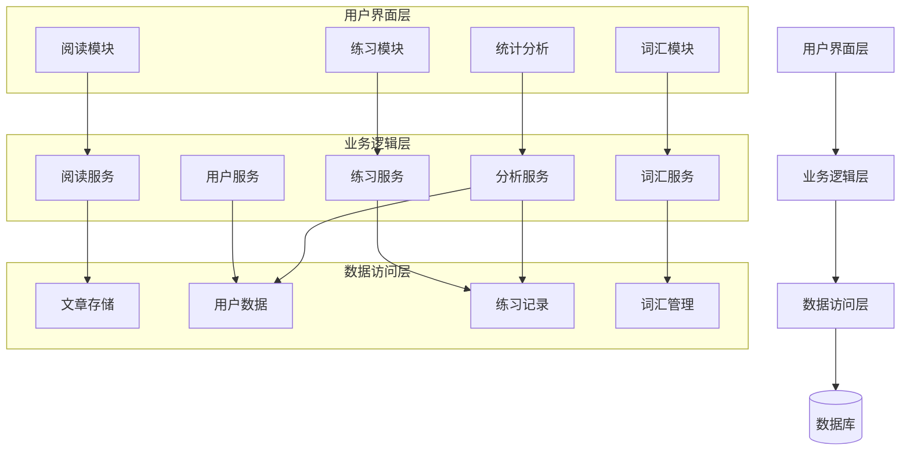
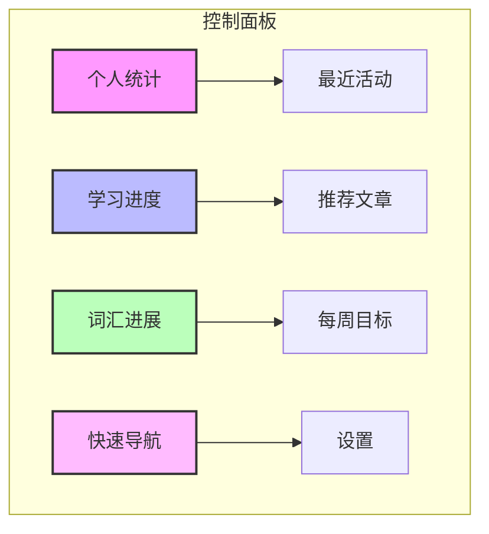
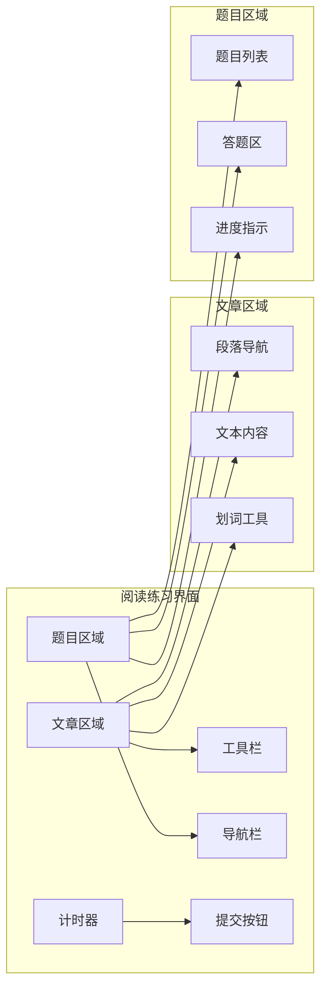
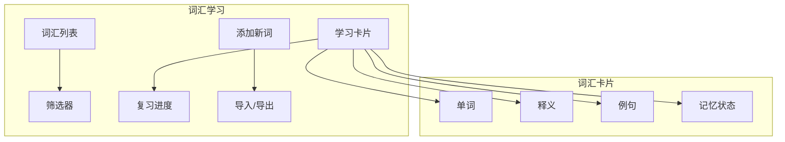

# 雅思阅读功能设计文档

## 1. 项目概述

在现有的 Epic Stack Remix 项目中集成雅思阅读训练系统，提供全面的雅思阅读备考工具，帮助用户提高阅读理解能力和应试技巧。

## 2. 系统架构

### 2.1 技术栈

- **前端**：React、Remix、TailwindCSS
- **后端**：Node.js、Express、Remix
- **数据库**：SQLite（通过 Prisma ORM）
- **认证**：继承现有项目的认证系统

### 2.2 系统模块



## 3. 功能需求

### 3.1 阅读文章管理

#### 3.1.1 阅读文章库
- 提供丰富的雅思阅读文章，按主题和难度分类
- 支持文章的增加、修改和删除（管理员功能）
- 文章元数据包括：标题、内容、难度级别、主题分类、词汇量等

#### 3.1.2 文章阅读界面
- 清晰的文章排版，模拟真实考试界面
- 支持文本划词查询和标记
- 阅读进度保存
- 沉浸式阅读模式

### 3.2 题型训练

#### 3.2.1 多样化题型支持
- 单选题/多选题
- 判断题（True/False/Not Given）
- 匹配题（配对、标题匹配）
- 填空题（摘要填空、句子填空）
- 简答题
- 段落信息定位

#### 3.2.2 做题界面
- 分屏显示文章和题目
- 支持文章内容检索
- 定时功能，模拟实际考试时间限制
- 答题进度实时保存

### 3.3 学习追踪与分析

#### 3.3.1 学习数据记录
- 练习历史记录
- 答题准确率统计
- 答题速度分析
- 错题集管理

#### 3.3.2 个性化分析
- 题型掌握程度分析
- 弱点识别
- 学习时间分布
- 进步趋势图表

### 3.4 词汇学习

#### 3.4.1 生词管理
- 阅读中生词标记功能
- 个人词汇库
- 词汇分类和标签

#### 3.4.2 词汇训练
- 单词记忆卡片
- 上下文学习
- 间隔重复复习计划
- 词汇测试

### 3.5 学习计划

#### 3.5.1 定制化学习计划
- 基于目标分数的学习计划生成
- 每日学习任务推荐
- 学习提醒和激励机制

#### 3.5.2 模拟测试
- 完整雅思阅读模拟测试
- 自动评分和详细解析
- 模拟考试历史记录

## 4. 数据模型

```prisma
// 雅思阅读模块数据模型

// 阅读文章
model IeltsPassage {
  id           String   @id @default(cuid())
  title        String
  content      String   @db.Text
  difficulty   String   // "easy", "medium", "hard"
  topic        String
  wordCount    Int
  source       String?
  createdAt    DateTime @default(now())
  updatedAt    DateTime @updatedAt
  
  // 关联
  questions    IeltsQuestion[]
  attempts     IeltsAttempt[]
  userVocabs   IeltsUserVocabulary[]
  readingLogs  IeltsReadingLog[]
}

// 阅读题目
model IeltsQuestion {
  id           String   @id @default(cuid())
  passageId    String
  passage      IeltsPassage @relation(fields: [passageId], references: [id], onDelete: Cascade)
  type         String   // "multiple-choice", "true-false-ng", "matching", "fill-blank", "short-answer"
  questionText String   @db.Text
  options      String?  @db.Text  // JSON 格式存储选项
  correctAnswer String  @db.Text
  explanation  String   @db.Text
  points       Int      @default(1)
  orderIndex   Int      // 在文章中的顺序
  createdAt    DateTime @default(now())
  updatedAt    DateTime @updatedAt
  
  // 关联
  responses    IeltsResponse[]
  
  // 索引
  @@index([passageId])
  @@index([type])
}

// 用户练习会话
model IeltsAttempt {
  id           String   @id @default(cuid())
  userId       String
  user         User     @relation(fields: [userId], references: [id], onDelete: Cascade)
  passageId    String
  passage      IeltsPassage @relation(fields: [passageId], references: [id], onDelete: Cascade)
  isTest       Boolean  @default(false)  // 是否为测试模式
  startedAt    DateTime @default(now())
  completedAt  DateTime?
  totalScore   Float?
  maxScore     Int?
  timeSpent    Int?     // 耗时（秒）
  
  // 关联
  responses    IeltsResponse[]
  
  // 索引
  @@index([userId])
  @@index([passageId])
  @@index([userId, completedAt])
}

// 用户题目作答
model IeltsResponse {
  id           String   @id @default(cuid())
  attemptId    String
  attempt      IeltsAttempt @relation(fields: [attemptId], references: [id], onDelete: Cascade)
  questionId   String
  question     IeltsQuestion @relation(fields: [questionId], references: [id], onDelete: Cascade)
  userAnswer   String
  isCorrect    Boolean
  timeTaken    Int?     // 该题耗时（秒）
  createdAt    DateTime @default(now())
  
  // 索引
  @@index([attemptId])
  @@index([questionId])
  @@unique([attemptId, questionId])
}

// 用户词汇表
model IeltsUserVocabulary {
  id           String   @id @default(cuid())
  userId       String
  user         User     @relation(fields: [userId], references: [id], onDelete: Cascade)
  word         String
  translation  String?
  context      String?  @db.Text
  note         String?  @db.Text
  passageId    String?
  passage      IeltsPassage? @relation(fields: [passageId], references: [id], onDelete: SetNull)
  mastered     Boolean  @default(false)
  createdAt    DateTime @default(now())
  lastReviewed DateTime?
  reviewCount  Int      @default(0)
  
  // 索引
  @@index([userId])
  @@index([userId, word])
  @@unique([userId, word])
}

// 阅读日志
model IeltsReadingLog {
  id           String   @id @default(cuid())
  userId       String
  user         User     @relation(fields: [userId], references: [id], onDelete: Cascade)
  passageId    String
  passage      IeltsPassage @relation(fields: [passageId], references: [id], onDelete: Cascade)
  startedAt    DateTime @default(now())
  endedAt      DateTime?
  progress     Float?   // 阅读进度百分比
  
  // 索引
  @@index([userId])
  @@index([passageId])
}

// 学习计划
model IeltsStudyPlan {
  id           String   @id @default(cuid())
  userId       String
  user         User     @relation(fields: [userId], references: [id], onDelete: Cascade)
  targetScore  Float
  weeklyGoal   Int      // 每周目标小时数
  startDate    DateTime
  targetDate   DateTime?
  isActive     Boolean  @default(true)
  createdAt    DateTime @default(now())
  updatedAt    DateTime @updatedAt
  
  // 关联
  tasks        IeltsStudyTask[]
  
  // 索引
  @@index([userId])
}

// 学习任务
model IeltsStudyTask {
  id           String   @id @default(cuid())
  planId       String
  plan         IeltsStudyPlan @relation(fields: [planId], references: [id], onDelete: Cascade)
  taskType     String   // "reading", "vocabulary", "practice", "test"
  description  String
  status       String   @default("pending") // "pending", "in-progress", "completed"
  dueDate      DateTime?
  completedAt  DateTime?
  passageId    String?
  
  // 索引
  @@index([planId])
  @@index([status])
}

// 用户统计数据
model IeltsUserStats {
  id              String   @id @default(cuid())
  userId          String   @unique
  user            User     @relation(fields: [userId], references: [id], onDelete: Cascade)
  readingTimeTotal Int     @default(0)  // 总阅读时间（分钟）
  passagesCompleted Int    @default(0)  // 完成的文章数
  testsCompleted   Int     @default(0)  // 完成的测试数
  avgAccuracy     Float?   // 平均准确率
  vocabLearned    Int      @default(0)  // 学习的单词数
  createdAt       DateTime @default(now())
  updatedAt       DateTime @updatedAt
}
```

## 5. 路由设计

```
/ielts
  /dashboard                       - 用户雅思学习控制面板
  /passages                        - 所有阅读文章列表
    /search                        - 文章搜索页面
    /:passageId                    - 特定文章详情
      /read                        - 纯阅读模式
      /practice                    - 练习模式（无时间限制）
      /test                        - 测试模式（有时间限制）
      /review                      - 文章回顾与解析
  /attempts                        - 用户所有练习记录
    /:attemptId                    - 特定练习详情与分析
  /vocabulary                      - 个人词汇管理
    /review                        - 词汇复习系统
    /test                          - 词汇测试
  /stats                           - 学习统计与分析
  /plan                            - 学习计划管理
    /create                        - 创建学习计划
    /:planId                       - 查看特定学习计划
  /admin                           - 管理员功能
    /passages                      - 文章管理
      /new                         - 添加新文章
      /:passageId/edit             - 编辑文章
    /questions                     - 题目管理
```

## 6. 界面设计

### 6.1 主要页面

#### 6.1.1 雅思阅读控制面板



#### 6.1.2 阅读练习界面



#### 6.1.3 词汇学习系统



### 6.2 用户体验设计原则

1. **考试模拟真实性**：界面和体验尽可能模拟真实雅思考试环境
2. **学习进度可视化**：清晰展示用户学习进度和成就
3. **响应式设计**：支持桌面、平板和移动设备
4. **无障碍性**：考虑视觉障碍等特殊需求用户
5. **直观导航**：简洁明了的操作流程，减少学习成本

## 7. 实现计划

### 7.1 阶段一：基础功能（4周）

- 数据模型设计与实现
- 阅读文章管理和展示
- 基本题型实现（选择题、判断题）
- 用户答题与评分系统

### 7.2 阶段二：核心功能（6周）

- 完善所有题型
- 考试计时功能
- 词汇标记和管理
- 学习数据统计和分析

### 7.3 阶段三：增强功能（5周）

- 个性化学习计划
- 高级词汇训练
- 用户学习历史分析
- 模拟测试系统优化

### 7.4 阶段四：集成与优化（3周）

- 系统性能优化
- UI/UX 细节完善
- 用户反馈收集与改进
- 上线准备

## 8. 测试策略

### 8.1 单元测试

- 数据模型 CRUD 操作
- 路由功能测试
- 组件渲染测试

### 8.2 集成测试

- 用户流程测试
- 数据一致性测试
- 权限控制测试

### 8.3 性能测试

- 大量数据下的系统响应时间
- 资源占用监控
- 并发用户测试

### 8.4 用户测试

- 真实用户体验反馈
- A/B 测试关键功能
- 可用性测试

## 9. 技术实现细节

### 9.1 前端组件架构

使用基于组件的开发方法，创建可复用的 UI 组件：

```typescript
// 示例：阅读文章组件
// app/components/ielts/PassageReader.tsx
import { useState, useEffect } from 'react';

interface PassageReaderProps {
  content: string;
  onWordSelect?: (word: string, context: string) => void;
  highlightedSections?: {start: number, end: number, color: string}[];
}

export function PassageReader({ 
  content, 
  onWordSelect,
  highlightedSections = []
}: PassageReaderProps) {
  // 实现文章阅读组件
  // ...
}
```

### 9.2 数据处理逻辑

实现数据获取和处理的 loader 和 action 函数：

```typescript
// 示例：文章练习页面
// app/routes/ielts.passages.$passageId.practice.tsx
import type { LoaderFunctionArgs, ActionFunctionArgs } from '@remix-run/node';
import { json, redirect } from '@remix-run/node';
import { useLoaderData, useActionData } from '@remix-run/react';
import { prisma } from '~/utils/db.server';
import { requireUserId } from '~/utils/auth.server';

export async function loader({ request, params }: LoaderFunctionArgs) {
  const userId = await requireUserId(request);
  const { passageId } = params;
  
  const passage = await prisma.ieltsPassage.findUnique({
    where: { id: passageId },
    include: { 
      questions: { orderBy: { orderIndex: 'asc' } }
    }
  });
  
  if (!passage) {
    throw new Response('文章不存在', { status: 404 });
  }
  
  // 查找或创建用户练习会话
  let attempt = await prisma.ieltsAttempt.findFirst({
    where: {
      userId,
      passageId,
      completedAt: null,
      isTest: false
    }
  });
  
  if (!attempt) {
    attempt = await prisma.ieltsAttempt.create({
      data: {
        userId,
        passageId,
        isTest: false
      }
    });
  }
  
  return json({ passage, attempt });
}

export async function action({ request, params }: ActionFunctionArgs) {
  const userId = await requireUserId(request);
  const formData = await request.formData();
  // 处理用户提交的答案
  // ...
}
```

### 9.3 性能优化策略

- 使用 React Suspense 和延迟加载
- 数据缓存
- 图片懒加载
- 分页处理大量数据

## 10. 安全考虑

### 10.1 数据安全

- 敏感数据加密
- 定期备份
- 数据访问控制

### 10.2 用户权限

- 基于角色的访问控制
- 管理员特权限制
- 操作日志记录

## 11. 扩展性与维护

### 11.1 模块化设计

- 功能模块独立封装
- 清晰的接口定义
- 统一的代码风格

### 11.2 文档与注释

- API 文档
- 代码注释规范
- 变更日志维护

## 12. 成功指标

- 用户注册转化率
- 日活跃用户数
- 用户平均学习时长
- 用户雅思成绩提升
- 用户满意度调查

## 附录

### A. 技术资源

- Remix 文档: https://remix.run/docs
- Prisma 文档: https://www.prisma.io/docs
- TailwindCSS 文档: https://tailwindcss.com/docs

### B. 参考资料

- 雅思官方阅读评分标准
- 雅思阅读题型分析
- 有效学习方法研究
